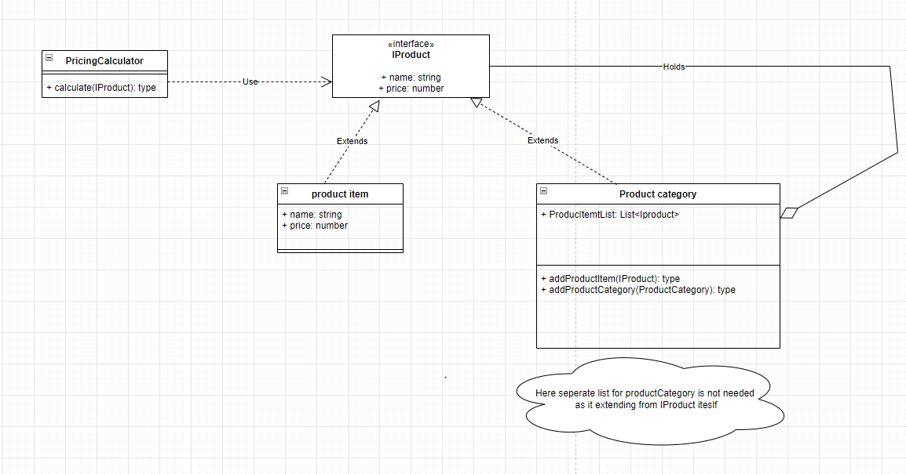

# Assignments

# Assignment -1:

Typical product database consists of two types of product components — product categories and product items. A product category is generally contain product items and also other product categories as its subcategories. Example Product Categories:

Computers
Desktops
Laptops
Peripherals
Printers
Cables The Computers product category contains both the Desktops and the Laptops product categories as its subcategories. The Desktop category can contain a product item such as Compaq Presario 5050. Product items are usually individual, in the sense that they do not contain any product component within. Design and implement an PricingCalculator to list the dollar value of a product component or Product Category.



## Assignment 2:
```
public class OnlineCart
{
    public void CheckOut(PaymentType paymentType)
    {
        switch(paymentType)
        {
            case PaymentType.CreditCard:
                    ProcessCreditCardPayment();
                    break;
            case PaymentType.Paypal:
                    ProcessPaypalPayment();
                    break;
            case PaymentType.GoogleCheckout:
                    ProcessGooglePayment();break;
            case PaymentType.AmazonPayments:P
                    ProcessAmazonPayment();
                    break;
        }
    }
    private void ProcessCreditCardPayment()
    {
        Print("Credit card payment chosen");
    }
    private void ProcessPaypalPayment(){
        Print("Paypal payment chosen");
    }
    private void ProcessGooglePayment()
    {
        Print("Google payment chosen");
    }
    private void ProcessAmazonPayment()
    {
        Print("Amazon payment chosen");
    }
}
```
## Violations:
- Single responsibility principal
- Open close principal -> say if we want to add new payment method

New design:

-----------


## Assignment 3: Vital monitor
- Given that you are desiging a vital monitor watch -> you need to send the vital information via mesaage to a care taker and also need to display in watch.
- Meditator pattern


## Assignment 4: 
- Refactor the above design -> remove the multiple inheritance (Diamond problem)

Question:


Answer:
- Diamond problem to split using composition/aggregation (HAS-A)
- This solved using Bridge Pattern (Don't use inheritance when the interface and class extending)
- Bridge pattern example: Turn on turn off the device using different interfaces (say remote, switch, alexa etc.)
- **Resources:**
- https://www.codeproject.com/Articles/890/Bridge-Pattern-Bridging-the-gap-between-Interface
  - Image viewer: to show any type of image on any os platform
  - Challenge: 
- Refactored solution


### Assignment - 5
#### CNC Monitoring and Alerting

We need a solution to interpret data coming out of a _CNC-machine monitor_.
Our purpose is to alert when something needs attention.
The alert needs to include information on the area that needs attention -
the machine or the environment.
The personnel that need to be alerted are different in each case.

A basic idea of CNC machines can be seen [here](https://en.wikipedia.org/wiki/Numerical_control).
Keeping these machines safe and reliable is vital in any manufacturing unit.

#### Monitored data

The _CNC-machine monitor_ gives the following data:

- Operating temperature: Temperature around the CNC machine in Celsius.
Reported every half-hour. Need to alert if it goes beyond 35 degrees.

- Part-dimension variation: In mm. A variation of more than 0.05 mm needs attention
(example: a drill-bit in the machine may need replacement)

- Duration of continuous operation: Reported in minutes.
Updated once every 15 minutes.
More than 6 hours of continuous operation requires attention.

- Self-test status-code, reported at startup

| Code | Meaning |
|---:|---|
|0xFF|All ok|
|0x00|No data (examples: no power, no connection to the data-collector)|
|0x01|Controller board in the machine is not ok|
|0x02|Configuration data in the machine is corrupted|

Assume that the above data is monitored and passed-on to your program.
You can choose to take the inputs as function calls to your program, or as events.

#### Expected outputs

The program needs to indicate if there is a need for attention.

When there is a need to attend,
it needs to offer an initial diagnosis,
to help in alerting the appropriate personnel:
It needs to convey whether the machine needs attention,
or if its environment needs attention.

#### Design-it

#### Assignment -6
---
https://github.com/venu-shastri/design-patterns-summary/blob/main/DEBT_CODE.docx

- Ans: Inheritance

#### Assignment 7
---
Let us build a sales reporting application for the management of a store with multiple departments. The features of the application include:

- Users should be able to select a specific department they are interested in.
- Upon selecting a department, two types of reports are to be displayed:
- Monthly report — A list of all transactions for the current month for the selected department.
- YTD sales chart — A chart showing the year-to-date sales for the selected department by month.
	Whenever a different department is selected, both reports should be refreshed with the data for the currently selected department 

- Ans: Mediator pattern

#### Assignemnt 8
---
Refactor Below Code and remove code pollution
``` C#
	public class ConcreteCalculator : ICalculator
{
    public int Add(int x, int y)
    {
        Print("Add(x={0}, y={1})", x, y);

        var addition = x + y;

        Print("result={0}", addition);

        return addition;
    }
}

```

- Ans : Decorator pattern -> this works at only one of the instance
- Ans 2: Proxy pattern -> let the proxy do logging -> this works for all instances

#### Assignment - 9
----
Let us consider an online job site that receives XML data files from different employers with current openings in their organizations. When the number of vacancies is small, employers can enter details online. When the number of vacancies is large, employers upload details in the form of an XML file. Once the XML file is received, it needs to be parsed and processed. Let us assume the XML file to have the following details: 
-  a.Job title
- b.Minimum qualifications
- c.Medical insurance 
- d.Dental insurance
- e.Vision care
- f.Minimum number of hours of work 
- g.Paid vacation 
- h.Employer name 
- i.Employer address In general,
 Details from (c) through (i) are all considered being the same for all jobs posted by a given employer. Apply the required pattern to design the process of parsing the input XML file and creating different JOB objects

 - Ans: Fly weight pattern
   - only Job type and min qualification varying.