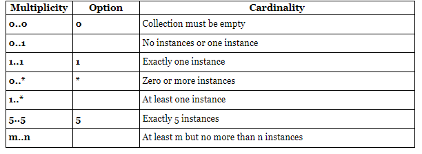

# Design Patterns

## Object oriented programming

- Object-oriented programming (OOP) is a computer programming model that organizes software design around data, or objects, rather than functions and logic. An object can be defined as a data field that has unique attributes and behavior.

## Main principles of OOP

1. **`Encapsulation:`** 

   - This principle states that all important information is contained inside an object and only select information is exposed. The implementation and state of each object are privately held inside a defined class. Other objects do not have access to this class or the authority to make changes. They are only able to call a list of public functions or methods. This characteristic of data hiding provides greater program security and avoids unintended data corruption.
   - Access modifier keywords are used for encapsulation in object oriented programming. For example, encapsulation in java is achieved using private, protected and public keywords.
   - **Example:**
  
        ``` Java
        public interface Employee {
            // read only access, as generally id will be fetched from DB.
            private String id;
            private String name;

            // Getter for ID
            public String getId() {
                return this.id;
            }
            // Getter for name
            public String getName() {
                return name;
            }

            // Setter for name
            public void setName(String newName) {
                this.name = newName;
            }
        }

        public class Main {
            public static void main(String[] args) {
                Person myObj = new Person();
                myObj.name = "John";  // error
                System.out.println(myObj.name); // error

                myObj.setName("John"); // Set the value of the name variable to "John"
                System.out.println(myObj.getName());
            }
        }

        ```

2. **`Abstraction`** 

    - Abstraction  is the process of hiding the internal details of an application from the outer world. Abstraction is used to describe things in simple terms. It’s used to create a boundary between the application and the client programs.
    - Abstraction in Java is implemented through interfaces and abstract classes. They are used to create a base implementation or contract for the actual implementation classes.
    - Real world example:
       - Your car is a great example of abstraction. You can start a car by turning the key or pressing the start button. You don’t need to know how the engine is getting started, what all components your car has. The car internal implementation and complex logic is completely hidden from the user.
    - ***Example:***

        ``` Java
        public interface Car {

            void turnOnCar();

            void turnOffCar();

            String getCarType();
        }

        public class ManualCar implements Car {

            private String carType = "Manual";
        
                @Override
                public void turnOnCar() {
                    System.out.println("turn on the manual car");
                }

                @Override
                public void turnOffCar() {
                    System.out.println("turn off the manual car");
                }

                @Override
                public String getCarType() {
                    return this.carType;
                }
        }

        public class AutomaticCar implements Car {

            private String carType = "Automatic";

            @Override
            public void turnOnCar() {
                System.out.println("turn on the automatic car");
            }

            @Override
            public void turnOffCar() {
                System.out.println("turn off the automatic car");
            }

            @Override
            public String getCarType() {
                return this.carType;
            }
        }

        
        public class CarTest {

            public static void main(String[] args) {
                Car car1 = new ManualCar();
                Car car2 = new AutomaticCar();

                car1.turnOnCar();
                car1.turnOffCar();
                System.out.println(car1.getCarType());

                car2.turnOnCar();
                car2.turnOffCar();
                System.out.println(car2.getCarType());

            }
        }
        ```

   - The client program only knows about the Car and the functions that the Car provides. The internal implementation details are hidden from the client program.
  
3. **`Inheritance:`** 
   - Inheritance is the mechanism of creating new classes from existing ones.

4. **`Polymorphism:`** 
   - Polymorphism (from Greek, meaning “many forms”) is the ability of an object to take different forms and thus, depending upon the context, to respond to the same message in different ways. Take the example of a chess game; a chess piece can take many forms, like bishop, castle, or knight and all these pieces will respond differently to the ‘move’ message.


# Class Diagram

- Class diagram is the backbone of object-oriented modeling - it shows how different entities (people, things, and data) relate to each other. In other words, it shows the static structures of the system.

- A class diagram describes the attributes and operations of a class and also the constraints imposed on the system. Class diagrams are widely used in the modeling of object-oriented systems because they are the only UML diagrams that can be mapped directly to object-oriented languages.

- The purpose of the class diagram can be summarized as:
  1. Analysis and design of the static view of an application;
  2. To describe the responsibilities of a system;
  3. To provide a base for component and deployment diagrams; and,
  4. Forward and reverse engineering.

**Class:**

- A class is depicted in the class diagram as a rectangle with three horizontal sections, as shown in the figure below. The upper section shows the class’s name (Flight), the middle section contains the properties of the class, and the lower section contains the class’s operations (or “methods”).

    

**Abstract class:**

- An abstract class is identified by specifying its name in italics. In the above diagram, both Person and Account classes are abstract classes

## Notations CheatSheet


# Relationships

## 1. Association (Uses - relationship)

- If two classes in a model need to communicate with each other, there must be a link between them. This link can be represented by an association. Associations can be represented in a class diagram by a line between these classes with an arrow indicating the navigation direction.
- By default, associations are always assumed to be bi-directional; this means that both classes are aware of each other and their relationship.
- By contrast, in a uni-directional association, two classes are related - but only one class knows that the relationship exists.
- In terms of coding:
  - An Object of class B is passed as an argument to a method of Class A. (or)
  - An object of class B is a local variable in a method of class A.
  
  - **Example:**
  
    ``` Java

        public class  Account {
            private int accountNumber;
            private double balance;

            public Account(int accountNumber) {
                this.accountNumber
            }

            public double getBalance() {
                // query from DB using account number and set the balance and return
                return this.balance;
            }
        }

        public class ATM {
            // Here object of account is being passed as an argument
            public void showBalance(Account account) {
                System.our.println('Available balance: '+ account.getBalance());
            }
        }

    ```

    

## 2. Aggregation (Has-A Relationship)

- Keys words: Holds, Part of life.
- Aggregation is a special type of association used when ever there exists a WHOLE PART relation ship between the two classes.
  - Here Whole is made up of one or more parts.
  - Part can be added or removed from the whole without disturbing its, functionalities.
  - The lifecycle of a PART class is independent of the WHOLE class’s lifecycle, in other words, WHOLE and PART are independent of each other (one can exists with out the other).
- **Examples:**

    | WHOLE              | PART |
    | ------------------ | -----------  |
    | Team               | Player       |
    | Club               | Member       |
    | Library            | Book         |
    | Car                | Music player |
    | Youtube Channel    | Subscriber   |


- **Sample code:**

  ``` java

    import java.util.*;

    public class Subscriber {
        private String subscriberName;
        private String emailId;
        private String country;

        public Subscriber(String subscriberName, String emailId, String country) {
            this.subscriberName = subscriberName;
            this.emailId = emailId;
            this.country = country;
        }
    }

    public class Channel {
        private String channelName;

        public Channel(String channelName) {
            this.channelName = channelName;
        }

        private List<Subscriber> subscribers;

        public subscriber(Subscriber subscriber) {
            this.subscriber.add(subscriber);
        }

        public String getChannelNme() {
            return this.channelName;
        }

        public int getSubscribersCount() {
            return this.subscribers.size();
        }
    }

    // Main function
    public class Application {
        public static void main(String[] arg){
            // PARTS
            Subscriber s1 = new Subscriber("Jack", "Jack@foo.com", "USA");
            Subscriber s2 = new Subscriber("Ravi", "Ravi@foo.com", "India");

            // WHOLE
            Channel c1 = new Channel("HelloProgramming");
            Channel c2 = new Channel("Comics");

            c1.subscriber(s1);
            c1.subscriber(s2);

            c2.subscriber(s1);

            c1.getSubscribersCount() // 2
            c2.getSubscribersCount() // 1
        }
    }

  ```

    

## 3. Composition (HAS- A relationship)

- Key words: contains, HAS-A
- The composition relationship is just another form of the aggregation relationship, but the child class’s instance lifecycle is dependent on the parent class’s instance lifecycle.
- In other words, It is also a WHOLE PART relationship where
  - Whole is responsible for creation and destruction of the parts.
  - Part will not function independently
  - Whole will not function without part.

- Examples:
    | WHOLE         | PART         |
    | ------------- | -----------  |
    | Car           | Engine       |
    | Human         | Emotions     |
    | School        | ClassRoom    |
    | Book          | Pages        |
    | House         | Rooms        |

- **Sample code:**

    ``` Java
    public class Engine {
        public String make;
        public String model;
        public String price;

        public Engine(String make, String model, String price) {

        }
    }

    public class Car {
        private Engine engine;
        // The life of the engine obj depends on the class obj, 
        // if the class obj deleted then the engine obj will be discarded/ removed
        // so the creation and destruction of engine depends on the car
        public Car() {
            this.engine = new Engine("Honda", "ZA-4 Stroke petrol", 50000);
        }
    }

    ```
    

## 4. INheritance

- Inheritance is the mechanism for combining similar classes of objects into a single, more general class. Inheritance identifies commonalities among a set of entities. example, Admin, Employee, and Accountant, all are Person.


## 5. Multiplicity

- Multiplicity indicates how many instances of a class participate in the relationship. It is a constraint that specifies the range of permitted cardinalities between two classes.
- Multiplicity is a definition of cardinality - i.e. number of elements - of some collection of elements.
- Some typical examples of multiplicity:

    
