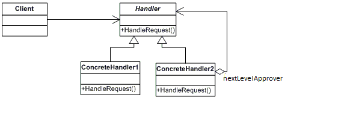

# Chain of responsibility Pattern

- In a chain of responsibility pattern implementation, the sender's request is passed down a series of handler objects till one of those objects, handles the request or it remains unhandled and falls off the chain. Multiple objects are given a chance to handle the request. This allows us to decouple the sender and the receiver of a request.

- Usually the pattern is applied when the request can be handled by multiple objects and it is not known in advance which object will end up handling the request.

## Example

- Chain of Responsibility pattern in which several linked managers and executives can respond to a purchase request or hand it off to a superior. Each position has can have its own set of rules which orders they can approve.
  - Problem statement:
    - 3 roles President -> Vice president -> Director
    - Director can approve the purchase request if the order value <= 25,000 else needed VP approval.
    - VP can approve <= 50,000 else president approval needed.
    - President can approve <= 1 Lakh else executive meeting required to take decision.

``` Java

    public class Purchase
    {
        public String purchaseId;
        public double amount;
        public String purpose;
        // Constructor
        public Purchase(String purchaseId, double amount, String purpose)
        {
            this.purchaseId = purchaseId;
            this.amount = amount;
            this.purpose = purpose;
        }
    }


    public abstract class Approver {
        protected String approverName;
        protected String approverRole;
        protected Approver nextLevelApprover;
        public abstract void ProcessRequest(Purchase purchase);

        // Optional we can create the composition relationship, the requirement won't change
        public void setNextLevelApprover(Approver nextLevelApprover) {
            this.nextLevelApprover = nextLevelApprover;
        }
    }

    public class Director extends Approver {

        public Director(String approverName) {
            this.approverName = approverName;
            this.approverRole = "Director";
        }

        public void ProcessRequest(Purchase purchase) {
            if(purchase.amount <= 25000) {
                String msg = String.format("purchase order id # %s, approved by %s %s", purchase.purchaseId, this.approverRole, this.approverName);
                System.out.println(msg);
            }
            else if(this.nextLevelApprover != null) {
                this.nextLevelApprover.ProcessRequest(purchase);
            }
        }
    }

    public class VicePresident extends Approver {

        public Director(String approverName) {
            this.approverName = approverName;
            this.approverRole = "VicePresident";
        }

        public void ProcessRequest(Purchase purchase) {
            if(purchase.amount <= 50000) {
                String msg = String.format("purchase order id # %s, approved by %s %s", purchase.purchaseId, this.approverRole, this.approverName);
                System.out.println(msg);
            }
            else if(this.nextLevelApprover != null) {
                this.nextLevelApprover.ProcessRequest(purchase);
            }
        }
    }

    public class President extends Approver {

        public Director(String approverName) {
            this.approverName = approverName;
            this.approverRole = "President";
        }

        public void ProcessRequest(Purchase purchase) {
            if(purchase.amount <= 25000) {
                String msg = String.format("purchase order id # %s, approved by %s %s", purchase.purchaseId, this.approverRole, this.approverName);
                System.out.println(msg);
            }
            else  {
                String msg = String.format("purchase order id # %s requires executive meeting to evaluate the need and take the decision ", purchase.purchaseId);
                System.out.println(msg);
            }
        }
    }

     public class Program
    {
        public static void Main(string[] args)
        {
            // Setup Chain of Responsibility
            Approver larry = new Director();
            Approver sam = new VicePresident();
            Approver tammy = new President();
            larry.setNextLevelApprover(sam);
            sam.setNextLevelApprover(tammy);
            // Generate and process purchase requests
            Purchase p = new Purchase("P-2034", 350.00, "Supplies");
            larry.ProcessRequest(p);
            p = new Purchase("P-2035", 32590.10, "Project X");
            larry.ProcessRequest(p);
            p = new Purchase("P-2036", 122100.00, "Project Y");
            larry.ProcessRequest(p);
        }
    }

```

## UML



The classes and objects participating in this pattern include:

- Handler   (Approver)
  - defines an interface for handling the requests
  - (optional) implements the nextApprover link
- ConcreteHandler   (Director, VicePresident, President)
  - handles requests it is responsible for
  - can access its next level approver
  - if the ConcreteHandler can handle the request, it does so; otherwise it forwards the request to its successor.

- Client   (ChainApp)
  - initiates the request to a ConcreteHandler object on the chain

## Other example

- Interceptors like OAuthInterceptor, JWTInterceptor, UserNamePasswordInterceptor.
- Frontend developers might recall how event handlers work in
javascript. If a button is clicked and its event handler method is
implemented then the event would get handled and can be stopped
from bubbling up to the parent element's event handler. The event
handlers can be thought of as forming a chain starting from the leaf
(innermost) HTML element all the way to the root element. Note that
browsers also support event capturing where the event travels from
the outermost HTML element to the innermost. One departure from
the textbook definition of the pattern is that stopping the event from
propagation to the next successor is optional.
- Another example is how a web request passes through several filters.
`javax.servlet.Filter.doFilter()` follows the chain of responsibility
pattern. The doFilter method of the Filter is called by the container
each time a request/response pair is passed through the chain due to
a client request for a resource at the end of the chain. The
FilterChain passed into this method allows the Filter to pass on the
request and response to the next entity in the chain