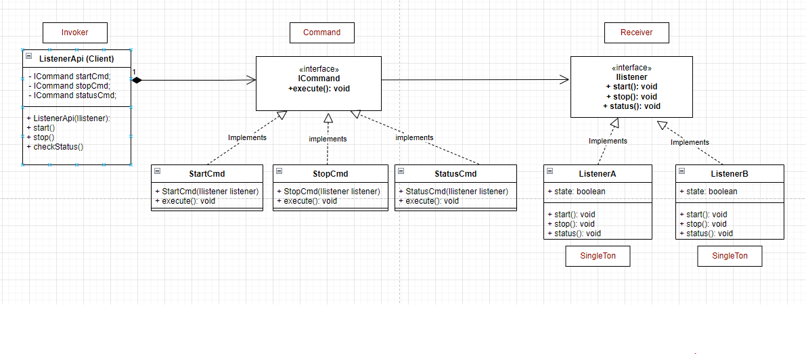

# Command Pattern

- The Command design pattern encapsulates a request as an object, thereby letting you parameterize clients with different requests, queue or log requests, and support un doable operations.

- Lets consider an example:

  - Say you are developing an JMS message listener service, And you were asked to develop a feature to expose an API to start, stop and check the status of a given listener, so that user can remotely control the JMS listeners.

- Now lets elaborate  the definition:
  
  - `Encapsulates a request as an object`:   in our analogy means that the Listener API used to turn on the ListenerA can later be used to turn on ListenerB. and so on so forth.
  - `queue or log requests, and support un doable operations`: means that Command’s Execute operation can store state for reversing its effects in the Command itself. The Command may have an added unExecute operation that reverses the effects of a previous call to execute.It may also support logging changes so that they can be reapplied in case of a system crash.

## Other Examples

- java.lang.Runnable defines the interface implemented by classes whose instances are executed by threads.
- Implementations of javax.swing.Action also conform to the command pattern.

## Code

``` Java

    public interface IListener {
        public void start();
        public void stop();
        public void status();
    }

    public abstract class ICommand {
        private IListener listener;
        public void Execute();
    }

    public class StartCommand implements ICommand {
         public StartCommand(IListener listener) {
            this.listener = listener;
         }
         public void Execute() {
            System.out.println("Start command executed");
            this.listener.start();
         }
    }

    public class StopCommand implements ICommand {
        public StopCommand(IListener listener) {
            this.listener = listener;
        }
         public void Execute() {
            System.out.println("Stop command executed");
            this.listener.stop();
         }
    }

    public class StatusCommand implements ICommand {
        public StatusCommand(IListener listener) {
            this.listener = listener;
        }
         public void Execute() {
            System.out.println("Status command executed");
            this.listener.status();
         }
    }


    public class ListenerA implements IListener {
        private static ListenerA instance;
        private Boolean state;

        //single ton
        private ListenerA() {}

         public static ListenerA getInstance() {
            if(instance == null){
                instance =  new ListenerA();
            }
            return instance;
        }

        public void start() {
            this.state = true;
            System.out.println(">>>>>>>>>> ListenerA started >>>>>>>>>");
        }
        public void stop() {
            this.state = false;
            System.out.println(">>>>>>>>>> ListenerA stopped >>>>>>>>>");

        }
        public void status() {
            if(this.state) {
                System.out.println(">>>>>>>>>> ListenerA is running >>>>>>>>>");
            }
            System.out.println(">>>>>>>>>> ListenerA has stopped >>>>>>>>>");
        }
    }

    public class ListenerB implements IListener {
        private static ListenerA instance;
        private Boolean state;

        //single ton
        private ListenerB() {}

        public static ListenerB getInstance() {
            if(instance == null){
                instance =  new ListenerB();
            }
            return instance;
        }

        public void start() {
            this.state = true;
            System.out.println(">>>>>>>>>> ListenerB started >>>>>>>>>");
        }
        public void stop() {
            this.state = false;
            System.out.println(">>>>>>>>>> ListenerB stopped >>>>>>>>>");

        }
        public void status() {
            if(this.state) {
                System.out.println(">>>>>>>>>> ListenerB is running >>>>>>>>>");
            }
            System.out.println(">>>>>>>>>> ListenerB has stopped >>>>>>>>>");
        }
    }

    public class ListenerApi {
        ICommand startCmd;
        ICommand stopCmd;
        ICommand statusCmd;

        public ListenerApi(IListener listener) {
            startCmd = new StartCommand(listener);
            stopCmd = new StopCommand(listener);
            statusCmd = new StatusCommand(listener);
        }

        public void start() {
            startCmd.execute();
        }

        public void stop() {
            startCmd.execute();
        }

        public void status() {
            startCmd.execute();
        }
    }

    public class Program {

        public static void main (String[] args) {
            ListenerA listenerA = ListenerA.getInstance();
            // Assume that we exposed an API, so that user can start stop and the status of the listener remotely.
            // User will specify which Listener he need to operate.
            ListenerApi api = new ListenerApi(listenerA);
            api.start();
            api.status();
            api.stop();
        }

    }

```

## Class diagram



## UML

