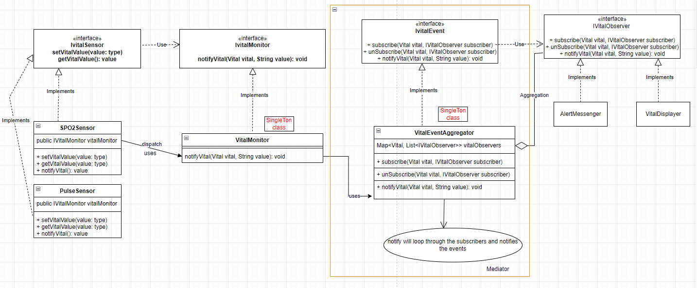

# Mediator Pattern

- A mediator is defined as a person who makes people involved in a conflict
come to an agreement.

- This pattern is applied to encapsulate or centralize the interactions amongst a number of objects. Object orientated design may result in behavior being distributed among several classes and lead to too many connections among objects. The encapsulation keeps the objects from referring to each other directly and the objects don't hold references to each other anymore.
- Formally, the pattern is defined as encouraging loose coupling among interacting objects by encapsulating their interactions in a mediator object, thus avoiding the need for individual objects to refer to each other directly and allowing to vary object interactions independently.
- In object-oriented programming, programs often consist of many classes. Business logic and computation are distributed among these classes. However, as more classes are added to a program, especially during maintenance and/or refactoring, the problem of communication between these classes may become more complex. This makes the program harder to read and maintain. Furthermore, it can become difficult to change the program, since any change may affect code in several other classes.
- With the mediator pattern, communication between objects is encapsulated within a mediator object. Objects no longer communicate directly with each other, but instead communicate through the mediator. This reduces the dependencies between communicating objects, thereby reducing coupling.

- Examples: Rabbit MQ, Kafka

## Note

- Many to many communication, where as in Observer pattern it is One to many communication.

## Example

- Say we are asked to develop the vital monitor system, where it has to monitor different vitals like SPO2, Pulse etc. from their respective sensors and this data has to show in the watch display also need alert the care taker on timely manner.
  - constrains:
    - more Vital can be added, i,e it should auto scale.
    - Given observers (Cloud uploader, watch display, etc) can only interested in uploading/ showing necessary vitals as per user configured. i.e. subscribes to the given vital.
    - Observers can be scaled. say i future i would need to upload the data to could for analytics.

## Other examples

- `java.util.concurrent.ExecutorService` an Executor that provides methods to manage termination and methods that can produce a Future for tracking progress of one or more asynchronous tasks.
- `java.util.Timer` A facility for threads to schedule tasks for future execution in a background thread. Tasks may be scheduled for one time execution, or for repeated execution at regular intervals.

## Code (Vital monitor system)

``` Java
    import java.util.*;

    public enum Vital {
        SPO2,
        pulse,
    }

    public interface IVitalMonitor {
        public void notifyVital(Vital vital, String value);
    }

    // Subject
    public interface IVitalSensor {
        public String getVitalValue();
        public void setVitalValue(String value);
        public void notifyVital();
    }

    // Observer
    public abstract class IVitalObserver {
        public String observerName;
        public abstract void subscribe(Vital vital);
        public abstract void unSubscribe(Vital vital);
        public abstract void update(Vital vital, String value);
    }

    public interface IVitalEvent {
        public void subscribe(Vital vital, IVitalObserver subscriber);
        public void unSubscribe(Vital vital, IVitalObserver subscriber);
        public void notifyVital(Vital vital, String value);
    }

    // Singleton class
    public class VitalEventMediator implements IVitalEvent {
        private Map<Vital, List<IVitalObserver>> vitalObservers = new HashMap<>();

        private static VitalEventMediator singleInstance;

        // private constructor
        private VitalEventMediator() {};

        public static VitalEventMediator getInstance() {
            if (singleInstance == null)
                singleInstance = new VitalEventMediator();
            return singleInstance;
        }

        public void subscribe(Vital vital, IVitalObserver subscriber) {
            if (!vitalObservers.containsKey(vital)) {
                List<IVitalObserver> observers = new ArrayList<IVitalObserver>();
                observers.add(subscriber);
                vitalObservers.put(vital, new ArrayList<IVitalObserver>(){

                });
            }
            vitalObservers.get(vital).add(subscriber);
        }
        public void unSubscribe(Vital vital, IVitalObserver subscriber) {
            // remove observer -> from given vital and then remove subscriber from the list
        }
        public void notifyVital(Vital vital, String value) {
            if (vitalObservers.containsKey(vital)) {
                List<IVitalObserver> observers = vitalObservers.get(vital);
                for(IVitalObserver observer: observers) {
                    observer.update(vital, value);
                }
            }
        }
    }

    // Singleton class- This could be normal class as well
    // But there is no need to create multiple obj as dependency VitalEventMediator is single ton
    public class VitalMonitor implements IVitalMonitor {
         private static VitalMonitor singleInstance;
        private IVitalEvent mediator;

        // private constructor
        private VitalMonitor(){
            this.mediator = VitalEventMediator.getInstance();
        };

        public static VitalMonitor getInstance() {
            if (singleInstance == null)
            singleInstance = new VitalMonitor();
            return singleInstance;
        }

        public void notifyVital(Vital vital, String value) {
            this.mediator.notifyVital(vital, value);
        }
    }

    // sensor 1 - SPO2 Sensor
    public Class SPO2Sensor implements IVitalSensor {
        private String units;
        private String value;
        private Vital vitalName;
        public IVitalMonitor vitalMonitor;

        public SPO2Sensor() {
            this.vitalName = Vital.SPO2;
            this.units = "%";
            this.vitalMonitor = VitalMonitor.getInstance();
        }
        public String getVitalValue() {
            return value;
        }
        public void setVitalValue(String value) {
            this.value = value;
            this.notifyVital();
        }

        public void notifyVital() {
            // notify value
            this.vitalMonitor.notifyVital(this.vitalName, this.value + " " + this.units);
        }
    }

    // Sensor 2 - Pulse sensor
    public Class PulseSensor implements IVitalSensor {
        private String units;
        private String value;
        private Vital vitalName;
        public IVitalMonitor vitalMonitor;

        public PulseSensor() {
            this.vitalName = Vital.pulse;
            this.units = "BPM";
            this.vitalMonitor = VitalMonitor.getInstance();
        }
        public String getVitalValue() {
            return value;
        }
        public void setVitalValue(String value) {
            this.value = value;
            this.notifyVital();
        }

        public void notifyVital() {
            // notify value
            this.vitalMonitor.notifyVital(this.vitalName, this.value + " " + this.units);
        }
    }

    // Observer concrete implementation
    public class VitalObserver implements IVitalObserver {
        public  String observerName;
        private IVitalEvent mediator;
        
        public VitalObserver(String observerName) {
            this.observerName = observerName;
            this.mediator = VitalEventMediator.getInstance();
        }

        public void subscribe(Vital vital) {
            this.mediator.subscribe(vital, this);
        }

        public void unSubscribe(Vital vital) {
            this.mediator.subscribe(vital, this);
        }

        public void update(Vital vital, String value) {
            String message = String.format("%s Observer received an update for vital: %s, Vital value: %s", this.observerName, vital, value);
            System.out.println(message);
        }

    }

    // Client code
    public class Client {
        public static void main(String[] args) {
        // observer -1
        IVitalObserver watchDisplayer = new VitalObserver("WATCH_DISPLAYER");
        // observer -2
        IVitalObserver altersAggregator = new VitalObserver("ALERTS_AGGREGATOR");

        // altersAggregator -> observe only for pulse
        altersAggregator.subscribe(Vital.pulse);

        // Subscribe for both SPO2 and pulse
        watchDisplayer.subscribe(Vital.SPO2);
        watchDisplayer.subscribe(Vital.pulse);

        // Simulate vital sensors
        IVitalSensor spo2Sensor = new SPO2Sensor();
        spo2Sensor.setVitalValue("98");
        spo2Sensor.setVitalValue("97");
        spo2Sensor.setVitalValue("96");

        IVitalSensor pulseSensor = new PulseSensor();
        pulseSensor.setVitalValue("120");
        pulseSensor.setVitalValue("118");
        pulseSensor.setVitalValue("116");

        }
    }


```

Output:

```

WATCH_DISPLAYER Observer received an update for vital: SPO2, Vital value: 98 %
WATCH_DISPLAYER Observer received an update for vital: SPO2, Vital value: 97 %
WATCH_DISPLAYER Observer received an update for vital: SPO2, Vital value: 96 %

ALERTS_AGGREGATOR Observer received an update for vital: pulse, Vital value: 120 BPM
WATCH_DISPLAYER Observer received an update for vital: pulse, Vital value: 120 BPM
ALERTS_AGGREGATOR Observer received an update for vital: pulse, Vital value: 118 BPM
WATCH_DISPLAYER Observer received an update for vital: pulse, Vital value: 118 BPM
ALERTS_AGGREGATOR Observer received an update for vital: pulse, Vital value: 116 BPM
WATCH_DISPLAYER Observer received an update for vital: pulse, Vital value: 116 BPM
```

## Class diagram



## UML class and sequence diagram


In the above UML class diagram, the Colleague1 and Colleague2 classes do not refer to (and update) each other directly. Instead, they refer to the common Mediator interface for controlling and coordinating interaction (mediate()), which makes them independent from one another with respect to how the interaction is carried out. The Mediator1 class implements the interaction between Colleague1 and Colleague2.

The UML sequence diagram shows the run-time interactions. In this example, a Mediator1 object mediates (controls and coordinates) the interaction between Colleague1 and Colleague2 objects.

Assuming that Colleague1 wants to interact with Colleague2 (to update/synchronize its state, for example), Colleague1 calls mediate(this) on the Mediator1 object, which gets the changed data from Colleague1 and performs an action2() on Colleague2.

Thereafter, Colleague2 calls mediate(this) on the Mediator1 object, which gets the changed data from Colleague2 and performs an action1() on Colleague1.

## Full code

[Mediator pattern code](../../../code/mediator/Client.java)