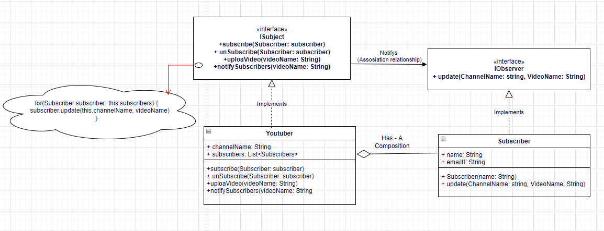
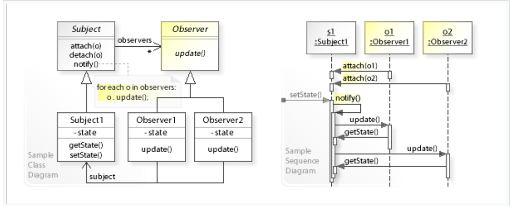

# Observer Pattern

- The observer pattern is a software design pattern in which an object, named the subject, maintains a list of its dependents, called observers, and notifies them automatically of any state changes, usually by calling one of their methods.

- Social media helps us immensely in understanding the observer pattern. If you are registered on Youtube then whenever you follow/subscribe someone, you are essentially asking Youtube to send you (the observer) new updates of the person (the subject) you followed. The pattern consists of two actors, the observer who is interested in the updates and the subject who generates the updates.

- A subject can have many observers and is a one to many relationship. However, an observer is free to subscribe to updates from other subjects too. You can subscribe to news feed from a Facebook page, which would be the subject and whenever the page has a new post, the subscriber would see the new post.

- A subject can have many observers and is a one to many relationship. However, an observer is free to subscribe to updates from other subjects too. You can subscribe to news feed from a Facebook page, which would be the subject and whenever the page has a new post, the subscriber would see the new post.

- One to many communication. (One YouTuber/ Subject -> many subscribers (observers))

## Other examples

- Frontend frameworks often involve the publisher-subscriber model, where a change in a DOM element on the webpage by a user causes a data-structure held in the browser's memory (think javascript code) gets updated. Angular (Event Emitter) and KnockoutJS frameworks are examples of this pattern.
- In Java, implementations of java.util.EventListener are examples of the observer pattern.

``` Java

    public Interface IObserver {
        public void update();
    }

    public Interface ISubject {
        public void subscribe();
        public void unSubscribe();
        public void notifyObservers();
        public void uploadVideo();
    }

    public class Subscriber implements IObserver {
        public String name;
        public String email;

        public Subscriber(String name) {
            this.name = name;
        }

        public void update(String YoutuberName, String videoName) {
            String message = String.format("Hey %s, %s has posted a new video named: %s, check it out if you interested.",this.name, YoutuberName, videoName);
            System.out.println(message);
        }
    }

    public class YouTuber implements ISubject {
        public List<Subscriber> subscribers;
        public String channelName = "";

        public YouTuber(String channelName) {
            this.channelName = channelName;
        }

        public void subscribe(Subscriber subscriber) {
            this.subscribers.add(subscriber);
        }

        public void unSubscribe(Subscriber subscriber) {
            // remove user from  subscribers list
        }

        public void uploadVideo(String videoName) {
            this.notifyObservers(videoName);
        }

        public void notifyObservers(String videoName) {
            for(Subscriber subscriber: this.subscribers) {
                subscriber.update(this.channelName, videoName)
            }
        }
    }

    public class Client {
        YouTuber channel1 = new YouTuber("TechBurner Channel");
        YouTuber channel2 = new YouTuber("TSeries Channel");

        Subscriber s1 = new Subscriber("Max");
        Subscriber s1 = new Subscriber("Jack");

        channel1.uploadVideo("Design patterns");
        channel1.uploadVideo("Hello Javascript");

        channel2.uploadVideo("New Tollyhood songs");
        channel2.uploadVideo("Latest English songs");

    }


```

## Class Diagram



## UML
