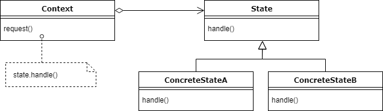

# State pattern

- The state pattern is a behavioral software design pattern that allows an object to alter its behavior when its internal state changes.
- The state pattern can be interpreted as a strategy pattern, which is able to switch a strategy through invocations of methods defined in the pattern's interface.

## Example

For example, we have a real time scenario. In a traffic signal, the state of the signal changes all the time. 
The red signal which indicates to stop, the green which indicates to go and so on. In this situation, the state of the signal changes from one state to another.
If we implement this scenario in the traditional approach, then it is very clumsy and a maintenance nightmare. We can resolve these kind of problems using state pattern.

| State     | next State|
| --------- | --------- |
| Red       | Orange    |
| Orange    | Green     |
| Green     | Red       |

``` java
    
    public class TrafficSignal {
        private ITrafficLight activeTrafficLight;

        TrafficSignal() {
            if(activeTrafficLight == null){
                this.activeTrafficLight = new RedTrafficLight();
            }
        }

        public void change() {
            this.activeTrafficLight.updateState();
        }

        public void setActiveTrafficLight(ITrafficLight currentLight) {
            this.activeTrafficLight = currentLight;
        }

        public void getActiveState() {
            String value = String.format("Current glowed light: %s", this.activeTrafficLight.color)
            System.out.println(value);
        }
    }

    public abstract ITrafficLight {
        public String color;
        public abstract void updateState(TrafficSignal context);
    }

    public class RedTrafficLight extends ITrafficLight {

        public RedTrafficLight() {
            this.color = "Red";
        }

        public void updateState(TrafficSignal context) {
            context.setActiveTrafficLight(new OrangeLight());
        }
    }

    public class OrangeTrafficLight extends ITrafficLight {

        public RedTrafficLight() {
            this.color = "Orange";
        }

        public void updateState(TrafficSignal context) {
            context.setActiveTrafficLight(new GreenLight());
        }
    }

    public class GreenTrafficLight extends ITrafficLight {

        public RedTrafficLight() {
            this.color = "Green";
        }

        public void updateState(TrafficSignal context) {
            context.setActiveTrafficLight(new RedLight());
        }
    }

    public class Client {
        public static void main(String[] args){
            TrafficSignal trafficSignal = new TrafficSignal();
            // simulate the lights glowing automatically
            int counter = 0
            while(counter <= 10) {
                traffic_light.change()
                traffic_light.getActiveState()
                counter = counter+1
            }
        }
    }
    
```

## UML Diagram



## Design participants

- State – The interface define operations which each state must handle.
- Concrete States – The classes which contain the state specific behavior.
- Context – Defines an interface to client to interact. It maintains references to concrete state object which may be used to define current state of object. It delegates state-specific behavior to different State objects.

## Note

- This pattern may seem very similar to the Strategy Pattern, however, the intent of the two patterns is very different.
- State pattern helps object to manage state, while Strategy pattern allows the client to choose different behavior.
- In the case of Strategy pattern, it’s client, which provides a different strategy to Context, on State pattern, the state transition is managed by Context or State itself. Also, if you are managing state transition in State object itself, it must hold reference of context so that it can call setState() method to change current state of Context

## Other examples

https://howtodoinjava.com/design-patterns/behavioral/state-design-pattern/

## Other references

https://medium.com/@osmanakar_65575/design-patterns-state-pattern-vs-strategy-pattern-9d6eb760cc0e
https://www.c-sharpcorner.com/article/the-difference-between-the-two-gof-patterns-strategy-and/
https://en.wikipedia.org/wiki/Strategy_pattern
https://en.wikipedia.org/wiki/State_pattern
