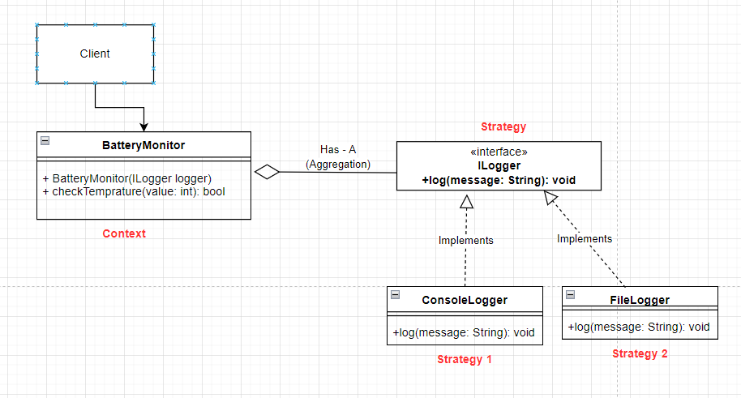

# Strategy Pattern

- In computer programming, the strategy pattern (also known as the policy pattern) is a behavioral software design pattern that enables selecting an algorithm at runtime. 
    Instead of implementing a single algorithm directly, code receives run-time instructions as to which in a family of algorithms to use
- The strategy pattern is formally defined as encapsulating algorithms
belonging to the same family and making them interchangeable. The
consumers of the common interface that the algorithms implement
allow switching out one algorithm for another seamlessly.

- The most trivial example one can think of is the family of logging
algorithms. Say our application is only concerned with logging the messages. All the logging algorithms can implement a common interface, that we call ILogger.

Example:

``` java

    public Interface ILogger {
        public void log(message: String);
    }

    public class ConsoleLogger implements ILogger {
        @Override()
        public void log(message: String) {
            // Do console logging
        }
    }

    public class FileLogger implements ILogger {
        @Override()
        public void log(message: String) {
            // do file logging
        }
    }
    
    /*
        Here class BatteryMonitor acts as Context
        The Context class holds a reference to the strategy object and when it
        receives requests from its clients, it forwards them to the strategy object
        along with the required data.
    */
    public class BatteryMonitor {
        private ILogger logger;

        // Constructor
        public BatteryMonitor(ILogger logger){
            // Constructor injection, HAS-Relationship, aggregation
            this.logger = logger;
        }

        public  boolean checkTemp(float temperature) {
            if(temperature < 0 || temperature > 45) {
                this.logger.log("Temperature is out of range!");
                return false;
            
            }
            return true;
        }
    }

    public class Client {
        ILogger consoleLogger = new ConsoleLogger();
        BatteryMonitor bm = new BatteryMonitor(consoleLogger);
    }

```

## Other examples

- `java.util.Comparator` has the method compare which allows the user
to define the algorithm or strategy to compare two objects of the
same type.
- Think how a text editor such as Microsoft Word can make use of the
strategy pattern when a client chooses the paragraph alignment
options. The strategies could be `justify text`, `left-align`, `right-align`
or `center-align`.

### Class diagram

