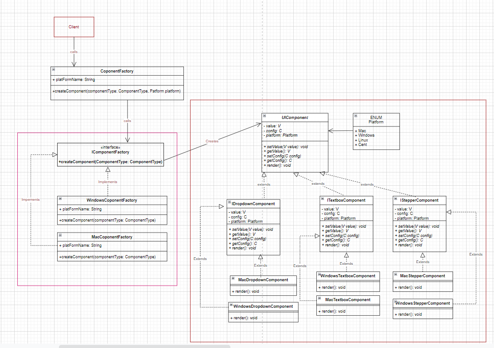
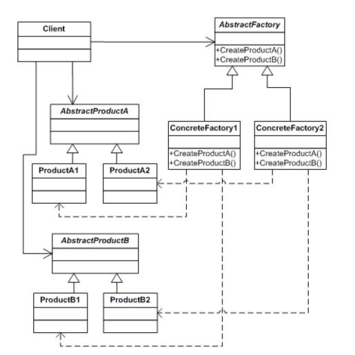

## Abstract factory pattern
- Abstract factory pattern is defined as defining an interface to create families of related or dependent objects without specifying their concrete classes.
- Abstract Factory pattern is almost similar to Factory Pattern is considered as another layer of abstraction over factory pattern. 
- Abstract factory pattern implementation provides us with a framework that allows us to create objects that follow a general pattern. So at runtime, the abstract factory is coupled with any desired concrete factory which can create objects of the desired type.

## Example
- Let’s take an example, Suppose we want to build a global UI component factory.
- If it was a factory design pattern, then it was suitable for a single platform. But for this pattern, we need multiple platforms(Mac, Windows) and some critical design changes.
- Now, our application should be smart enough to identify the platform where it is being used, so we should be able to use the appropriate UI component factory without even knowing which component factory implementation will be used internally.
- This also saves us from someone calling the wrong factory for a particular platform.
- Here we need another layer of abstraction that will identify the platform and internally use correct component factory implementation without even giving a single hint to the user. This is exactly the problem, which an abstract factory pattern is used to solve.

## Class diagram

## UML

## Resources
- https://www.codeproject.com/Articles/328373/Understanding-and-Implementing-Abstract-Factory-Pa
- https://www.geeksforgeeks.org/abstract-factory-pattern/