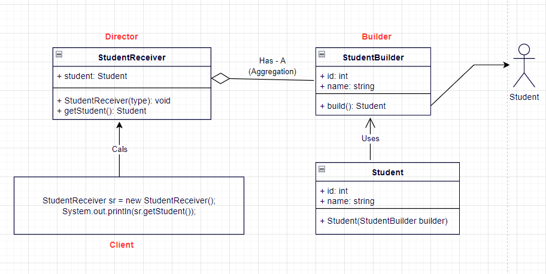

# Builder Pattern

- Builder Pattern belongs to creational pattern.

- As the name implies, a builder pattern is used to build objects. Sometimes,
the objects we create can be complex, made up of several sub-objects or
require an elaborate construction process. The exercise of creating
complex types can be simplified by using the builder pattern. A composite
or an aggregate object is what a builder generally builds.

- Formally, a builder pattern encapsulates or hides the process of
building a complex object and separates the representation of the
object and its construction. The separation allows us to construct
different representations using the same construction process

- Separate the construction of a complex object from its representation so that the same construction process can create different representations.

- Builder Pattern solves the situation of increasing constructor parameters and constructors of a given class by providing a step by step initialization of Parameters. After step by step initialization, it returns the resulting constructed Object at once.

### Implementation Guidelines

- We need to Choose Builder Design Pattern when
- We need to break up the construction of a complex object
- We need to create a complex object and it should be independent of the parts that make up the object
- The construction process must allow multiple representations of the same class
- The same fluent interface pattern can be now designed as builder pattern.

**Fluent Interface (Method chaining):** The idea behind a fluent interface is that one can apply multiple properties to an object by connecting them with dots and without having to re-specify the object each time.

Example: Say we have requirement to make few parameters as mandatory and few as optional, while create a obj.

``` java
    // Java code to demonstrate method chaining
    final class Student {

        // instance fields
        private int id;
        private String name;
        private String address;

        // Setter Methods
        // Note that all setters method
        // return this reference
        public Student setId(int id)
        {
            this.id = id;
            return this;
        }

        public Student setName(String name)
        {
            this.name = name;
            return this;
        }

        public Student setAddress(String address)
        {
            this.address = address;
            return this;
        }

        @Override
        public String toString()
        {
            return "id = " + this.id + ", name = " + this.name +
                                ", address = " + this.address;
        }
    }

    // Driver class
    public class MethodChainingDemo {
        public static void main(String args[])
        {
            Student student1 = new Student();
            Student student2 = new Student();

            student1.setId(1).setName("Ram").setAddress("Noida");
            student2.setId(2).setName("Shyam").setAddress("Delhi");

            System.out.println(student1);
            System.out.println(student2);
        }
}

```

```

// Output
id = 1, name = Ram, address = Noida
id = 2, name = Shyam, address = Delhi
```

**Need of Builder Pattern :** Method chaining is a useful design pattern but however if accessed concurrently, a thread may observe some fields to contain inconsistent values. Although all setter methods in above example are atomic, but calls in the method chaining can lead to inconsistent object state when the object is modified concurrently. The below example can lead us to a Student instance in an inconsistent state, for example, a student with name Ram and address Delhi.

```

    // Java code to demonstrate need of Builder Pattern

    // Server Side Code
    final class Student {

        // instance fields
        private int id;
        private String name;
        private String address;

        // Setter Methods
        // Note that all setters method
        // return this reference
        public Student setId(int id)
        {
            this.id = id;
            return this;
        }

        public Student setName(String name)
        {
            this.name = name;
            return this;
        }

        public Student setAddress(String address)
        {
            this.address = address;
            return this;
        }

        @Override
        public String toString()
        {
            return "id = " + this.id + ", name = " + this.name +
                                ", address = " + this.address;
        }
    }

    // Client Side Code
    class StudentReceiver {

        private final Student student = new Student();

        public StudentReceiver()
        {

            Thread t1 = new Thread(new Runnable() {
                @Override
                public void run()
                {
                    student.setId(1).setName("Ram").setAddress("Noida");
                }
            });

            Thread t2 = new Thread(new Runnable() {
                @Override
                public void run()
                {
                    student.setId(2).setName("Shyam").setAddress("Delhi");
                }
            });

            t1.start();
            t2.start();
        }

        public Student getStudent()
        {
            return student;
        }
    }

    // Driver class
    public class BuilderNeedDemo {
        public static void main(String args[])
        {
            StudentReceiver sr = new StudentReceiver();
            System.out.println(sr.getStudent());
        }
    }

```

```

// Output may be:

id = 2, name = Shyam, address = Noida
Another inconsistent output may be

id = 0, name = null, address = null

```

**Implementation :** In Builder pattern, we have a inner static class named Builder inside our Server class with instance fields for that class and also have a factory method to return an new instance of Builder class on every invocation. The setter methods will now return Builder class reference. We will also have a build method to return instances of Server side class, i.e. outer class.

``` java
    // Java code to demonstrate Builder Pattern

    // Server Side Code
    final class Student {

        // final instance fields
        private final int id;
        private final String name;
        private final String address;

        public Student(Builder builder)
        {
            this.id = builder.id;
            this.name = builder.name;
            this.address = builder.address;
        }

        // Static class Builder
        public static class Builder {

            /// instance fields
            private int id;
            private String name;
            private String address;

            public static Builder newInstance()
            {
                return new Builder();
            }

            private Builder() {}

            // Setter methods
            public Builder setId(int id)
            {
                this.id = id;
                return this;
            }
            public Builder setName(String name)
            {
                this.name = name;
                return this;
            }
            public Builder setAddress(String address)
            {
                this.address = address;
                return this;
            }

            // build method to deal with outer class
            // to return outer instance
            public Student build()
            {
                return new Student(this);
            }
        }

        @Override
        public String toString()
        {
            return "id = " + this.id + ", name = " + this.name +
                                ", address = " + this.address;
        }
    }

    // Client Side Code
    class StudentReceiver {

        // volatile student instance to ensure visibility
        // of shared reference to immutable objects
        private volatile Student student;

        public StudentReceiver()
        {

            Thread t1 = new Thread(new Runnable() {
                @Override
                public void run()
                {
                    student = Student.Builder.newInstance()
                                .setId(1)
                                .setName("Ram")
                                .setAddress("Noida")
                                .build();
                }
            });

            Thread t2 = new Thread(new Runnable() {
                @Override
                public void run()
                {
                    student = Student.Builder.newInstance()
                                .setId(2)
                                .setName("Shyam")
                                .setAddress("Delhi")
                                .build();
                }
            });

            t1.start();
            t2.start();
        }

        public Student getStudent()
        {
            return student;
        }
    }

    // Driver class
    public class BuilderDemo {
        public static void main(String args[])
        {
            StudentReceiver sr = new StudentReceiver();
            System.out.println(sr.getStudent());
        }
    }

```
Output is guaranteed to be one of below:
```

id = 1, name = Ram, address = Noida
OR

id = 2, name = Shyam, address = Delhi
```



### References

https://www.geeksforgeeks.org/builder-pattern-in-java/

## Resources

https://javapapers.com/design-patterns/builder-pattern/

## Other examples

- String builder
- Human birth -> all will under same construction process, but different appearance with each other.