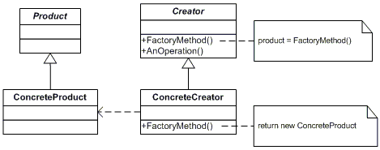

# Factory Pattern

- A factory produces goods, and a software factory produces objects. Usually, object creation in Java takes place like
    
    ```
    SomeClass someClassObject = new SomeClass();
    ```
- The problem with the above approach is that the code using the SomeClass's object, suddenly now becomes dependent on the concrete implementation of SomeClass. There's nothing wrong with using new to create objects but it comes with the baggage of tightly coupling our code to the concrete implementation class, which is a violation of code to an interface and not to an implementation.

## Definition

- Formally, the factory method is defined as providing an interface for object creation but delegating the actual instantiation of objects to subclasses.

## Example:

- Say You are building UI Component library. Now the UI framework will create the component dynamically based on the configuration. i.e. user will provide the component name or component alias name, and the component factory will create that component instance.

``` Java

public enum Components {
    dropDown,
    textBox,
    stepper
}
public abstract class IComponent<V, C> {
    protected Components componentName;
    private V value;
    private C config;

    public void setValue(V value) {
        this.value = value;
    }

    public V getValue() {
        return this.value;
    }

     public void setConfig(C config) {
        this.config = config;
    }

    public C getConfig() {
        return this.config;
    }

    public void onChange() {
        // emit value or set value
    }

    public abstract void render();
}

public class DropDownComponent IComponent<Object, Object> {
    public List<Map<String, String>> possibleValue = new ArrayList<>();
    public DropDownComponent() {
        this.componentName = Components.dropDown;
    }

    public void render() {
        // loop possible values -> construct options eg. <option> value 1 </option>
        // construct dropdown component
        // <select> Options </select>
    }
   
}

public class TextBoxComponent IComponent<String, Object> {
    // could be numeric, text, email, password
    public String type;
    public DropDownComponent() {
        this.componentName = Components.textBox;
        type = "text"
    }

    public void render() {
        // <input type= this.type>
    }
   
}

public class StepperComponent IComponent<Integer, Object> {
    // could be numeric, text, email, password
    public Integer min;
    public Integer max;
    public Integer incrementBy;
    public StepperComponent() {
        this.componentName = Components.stepper;
        // setting default values
        this.min = 0;
        this.max = 100;
        this.incrementBy = 1;
    }

    public void render() {
        // <input step= this.incrementBy, min = this.min, max = this.max>
    }
}

public class ComponentFactory {
    private static ComponentFactory instance;

    // singleTon
    private ComponentFactory(){}

    public static ComponentFactory getInstance() {
        if(instance == null) {
            instance = new ComponentFactory()
        }
        return instance;
    }

    public IComponent<?> getComponent(Components componentType) {
        // we can write some switch statements or we can keep the dict.
        // we can keep it as class level, for demo purpose maintaining here.
        Map<Components, IComponent<?>> componentsRegistry = new HashMap<>();

        componentsRegistry.put(Components.textBox, new TextBoxComponent());
        componentsRegistry.put(Components.stepper, new StepperComponent());
        componentsRegistry.put(Components.dropDown, new DropDownComponent());

        if(componentsRegistry.containsKey(componentType)){
            return componentsRegistry.get(componentType);
        }
        throw new NotSupportedException("Not a valid component type")
    }
}

public class Program {
    public static void main(String[] args) {
        ComponentFactory componentFactory = ComponentFactory.getInstance()
        List<Map<String, Object>> config =  new ArrayList<>();
        // pseudo code
        /*
        config = [
            {
                componentType: 'textbox',
                value: 'Jack',
                config: {
                    label: 'First name'
                    Placeholder: 'Enter your first name'
                }
            },
            {
                componentType: 'stepper',
                value: 25
                config: {
                    label: 'Age'
                }
            },
            {
                componentType: 'dropdown',
                value: 'Male',
                label: 'Select Gender'
                config: {
                    Placeholder: 'Select your Gender',
                    possibleValue: ['Male', 'Female', 'Others]
                }
            }
        ]
        */

        for(Map<String, Object> ele : config) {
            // Get the component instance
            IComponent<?> component = componentFactory.getComponent(ele.componentType);
            // Set component configuration
            component.config(ele.config);
            // render component into page
            component.render();
        }
    }
}

```
## UML

