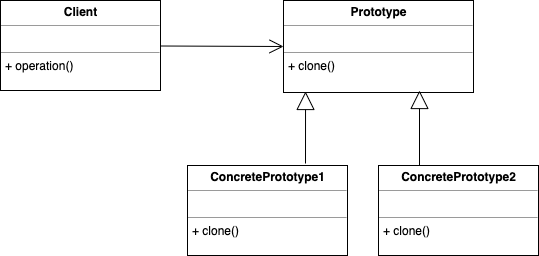

# Prototype pattern

- Prototype Pattern says that cloning of an existing object instead of creating new one and can also be customized as per the requirement.

- This pattern should be followed, if the cost of creating a new object is expensive and resource intensive.

- When we're trying to clone, we should decide between making a shallow or a deep copy. Eventually, it boils down to the requirements.

- For example, if the class contains only primitive and immutable fields, we may use a shallow copy.

- If it contains references to mutable fields, we should go for a deep copy. We might do that with copy constructors or serialization and deserialization.


## Example

- In some games, we want trees or buildings in the background. We may realize that we don't have to create new trees or buildings and render them on the screen every time the character moves.

- So, we create an instance of the tree first. Then we can create as many trees as we want from this instance (prototype) and update their positions. We may also choose to change the color of the trees for a new level in the game.

- The Prototype pattern is quite similar. Instead of creating new objects, we just have to clone the prototypical instance.


``` Java

public abstract class Tree {

    public double mass;
    public double height;
    public Position position;

    public Tree(double mass, double height) {
        this.mass = mass;
        this.height = height;
    }

    @Override
    public String toString() {
        return "Tree [mass=" + mass + ", height=" + height + ", position=" + position + "]";
    }

    public abstract Tree copy();
}

public class PlasticTree extends Tree {

    private String name;

    public PlasticTree(double mass, double height) {
        super(mass, height);
        this.name = "PlasticTree";
    }

    @Override
    public Tree copy() {
        PlasticTree plasticTreeClone = new PlasticTree(this.mass, this.height);
        plasticTreeClone.position = this.position;
        return plasticTreeClone;
    }

}

public class PineTree extends Tree {

    private String type;

    public PineTree(double mass, double height) {
        super(mass, height);
        this.type = "Pine";
    }

    @Override
    public Tree copy() {
        PineTree pineTreeClone = new PlasticTree(this.mass, this.height);
        plasticTreeClone.position = this.position;
        return pineTreeClone;
    }
}

public final class Position {

    private final int x;
    private final int y;

    public Position(int x, int y) {
        this.x = x;
        this.y = y;
    }

    public int getX() {
        return x;
    }

    public int getY() {
        return y;
    }

    @Override
    public int hashCode() {
        final int prime = 31;
        int result = 1;
        result = prime * result + x;
        result = prime * result + y;
        return result;
    }

    @Override
    public boolean equals(Object obj) {
        if (this == obj)
            return true;
        if (obj == null)
            return false;
        if (getClass() != obj.getClass())
            return false;
        Position other = (Position) obj;
        if (x != other.x)
            return false;
        if (y != other.y)
            return false;
        return true;
    }

    @Override
    public String toString() {
        return "Position [x=" + x + ", y=" + y + "]";
    }

}

public class TreePrototypeUnitTest {

    public void givenAPlasticTreePrototypeWhenClonedThenCreateA_Clone() {
        double mass = 10.0;
        double height = 3.7;
        Position position = new Position(3, 7);
        Position otherPosition = new Position(4, 8);

        PlasticTree plasticTree = new PlasticTree(mass, height);
        plasticTree.setPosition(position);
        PlasticTree anotherPlasticTree = (PlasticTree) plasticTree.copy();
        anotherPlasticTree.setPosition(otherPosition);

        System.out.println(plasticTree.toString());
        System.out.println(anotherPlasticTree.toString());

    }

    public void givenAPineTreePrototypeWhenClonedThenCreateA_Clone() {
        double mass = 10.0;
        double height = 3.7;
        Position position = new Position(3, 7);
        Position otherPosition = new Position(4, 8);

        PineTree pineTree = new PineTree(mass, height);
        pineTree.setPosition(position);
        PineTree anotherPineTree = (PineTree) pineTree.copy();
        anotherPineTree.setPosition(otherPosition);

        System.out.println(pineTree.toString());
        System.out.println(anotherPineTree.toString());
    }
    
    public void givenA_ListOfTreesWhenClonedThenCreateListOfClones() {
        double mass = 10.0;
        double height = 3.7;
        Position position = new Position(3, 7);
        Position otherPosition = new Position(4, 8);
        
        PlasticTree plasticTree = new PlasticTree(mass, height);
        plasticTree.setPosition(position);
        PineTree pineTree = new PineTree(mass, height);
        pineTree.setPosition(otherPosition);
        
        List<Tree> trees = Arrays.asList(plasticTree, pineTree);
        
        List<Tree> treeClones = trees.stream().map(Tree::copy).collect(toList());
        
        Tree plasticTreeClone = treeClones.get(0);
        
        System.out.println(plasticTreeClone.toString());
    }
}

```

## UML Diagram



- In the diagram, we see that the client is telling the prototype to clone itself and create an object. Prototype is an interface and declares a method for cloning itself. ConcretePrototype1 and ConcretePrototype2 implement the operation to clone themselves.