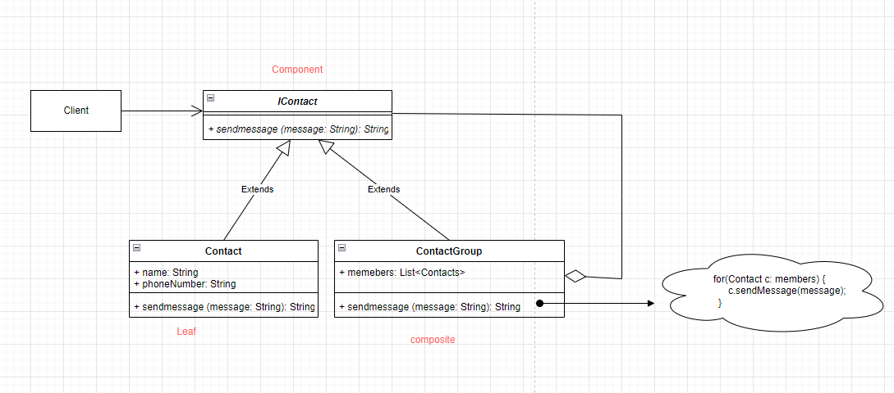
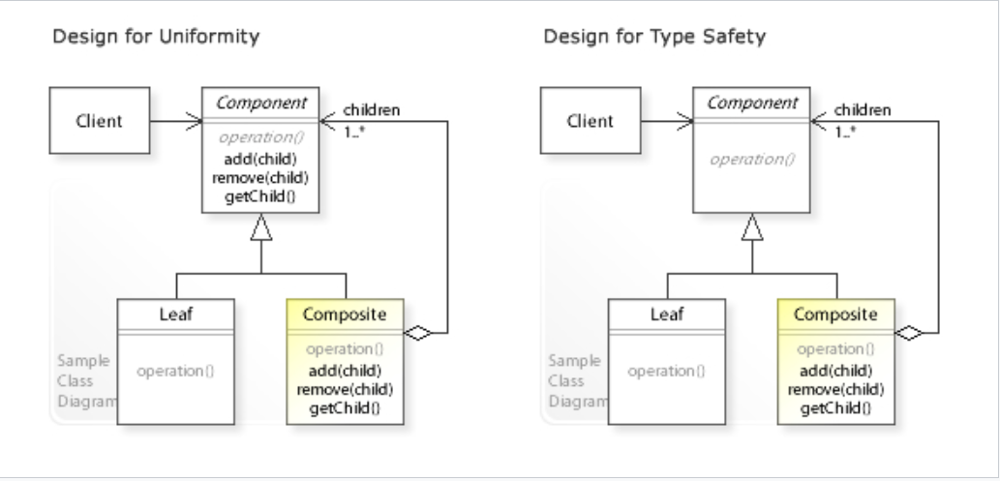

# Composite pattern

- In software engineering, the composite pattern is a partitioning design pattern. The composite pattern describes a group of objects that are treated the same way as a single instance of the same type of object.
- The intent of a composite is to "compose/create" objects into tree structures to represent part-whole hierarchies. 
- Implementing the composite pattern lets clients treat individual objects and compositions uniformly.
- The closest analogy you can imagine is a tree. The tree is a recursive data structure where each part itself is a sub-tree except for the leaf nodes. The root is the top-level composite and its children are either composites themselves or just leaf nodes. The leaf itself can be thought of as a tree with just a single node.
- Formally, the composite pattern is defined as composing objects into tree structures to represent part-whole hierarchies, thus letting clients uniformly treat individual objects and composition of objects.
- The pattern allows the clients to ignore the differences between the whole and the part.

```

A Real Life Example: Group Messaging
    Say, There are six people on my contact list:
     1. Mom, 2. Dad, 
     2. Uncle Bob, 4. Cousin Nick, 5. Aunt Julia,
     3. Amy jackson. 
    The Parents group is composed of 
        -Mom and Dad, 
    whereas the Uncle Bob’s Family group is composed of 
        - Uncle Bob, Cousin Nick, and Aunt Julia.
    
                                    Contacts
                                    --------
                                        |
            -----------------------------------------------------------------
            |                           |                                    |
          Parents                   Uncle Bob’s Family                      Amy jacksom
            |                           |                                     
        -----------                ---------------------------------
        |           |              |              |                 |
        MOM        DAD            Uncle Bob      Cousin Nick        Aunt Julia

```

- In Above example, Contacts is represented in a tree structure made of nodes. A node is either a group of people or a single person.
- If a node is a group of people, like Parents, then it contains other nodes. If a node is a single person, like Mom, then it’s a leaf node.
- For example, I can add another node, CollegeFriends, containing four friends, two of which are grouped into the Roommates node.

``` Java

    public abstract IContact {
        public abstract void sendMessage(String message) {
            System.out.println(message);
        };
    }

    public class Contact extends IContact {
        public String name;
        public String phoneNumber;

        public Contact(String name, String phoneNumber) {
            this.name = name;
            this.phoneNumber = phoneNumber;
        }
    }

    public class ContactGroup extends IContact {
        public String groupName  = "";
        public List<Contact> members =  new ArrayList();

        public ContactGroup(String groupName) {
            this.groupName = groupName;
        }

        public void addContact(Contact contact) {
            this.members.add(contact);
        }

        @Override()
        public void sendMessage(String message) {
            for(Contact c: members) {
                c.sendMessage(message);
            }
        }
    }

    public class Client {
        public static void main(String[] args) {
            IContact c1 = Contact("mom", "1256389")
            IContact c2 = Contact("dad", "4532164")

            # Sending message individually
            c1.sendMessage("HI Mom")
            c2.sendMessage("HI Dad")

            # Sending Group message
            GroupContact g1 = GroupContact()

            # Adding contacts to groups
            g1.addContact(c1)
            g1.addContact(c2)

            g1.sendMessage("Hello Everyone !")
        }
    }

```

## Class Diagram


## General diagram


## Other examples

- In Java, the class javax.faces.component.UIComponent is an example of the composite.
- Imagine a UI Menu widget which can have sub-menus and menu items that perform some action when clicked on by the user. The menus would form the composite while the menu-items would form the part.