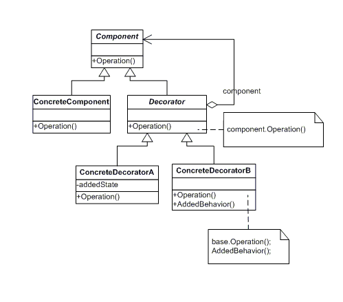

# Decorator Pattern

- Decorator pattern allows a user to add new functionality to an existing object without altering its structure.
- This type of design pattern comes under structural pattern as this pattern acts as a wrapper to existing class.
- This pattern creates a decorator class which wraps the original class and provides additional functionality keeping class methods signature intact.
- The strategy is to wrap the existing object within a decorator object that usually implements the same interface as the wrapped object. This allows the decorator to invoke the methods on the wrapped object and then add any additional behavior. Usually, the decorator adds behavior to the existing functionality of the wrapped object i.e. the decorator takes action either before or after invoking some method on the wrapped object.

## Example

- Consider a case of a pizza shop.
  - In the pizza shop they will sell few pizza varieties and they will also provide toppings in the menu.
  - Now imagine a situation wherein if the pizza shop has to provide prices for each combination of pizza and topping. 
    Even if there are four basic pizzas and 8 different toppings, the application would go crazy maintaining all these concrete combination of pizzas and toppings.
- Here comes the decorator pattern.
  - As per the decorator pattern, you will implement toppings as decorators and pizzas will be decorated by those toppings' decorators. 
  - Practically each customer would want toppings of his desire and final bill-amount will be composed of the base pizzas and additionally ordered toppings. 
  - Each topping decorator would know about the pizzas that it is decorating and it's price.  GetPrice() method of Topping object would return cumulative price of both pizza and the topping.

## Code

``` java

    public abstract class BasePizza {
      protected int price;
      protected String name;

      public int getPrice() {
        return this.price;
      }

      public String getName() {
        return this.name;
      }
      
    }

    public class MargheritaPizza extends BasePizza {

      public MargheritaPizza() {
          super();
          this.name = "MargheritaPizza";
          this.price = 200;
      }

    }

  public class GourmetPizza extends BasePizza {

      public GourmetPizza() {
          super();
          this.name = "GourmetPizza";
          this.price = 300;
      }
  }

  public abstract ToppingsDecorator extends BasePizza {
    protected BasePizza pizzaVariant;

    @Override
    public int getPrice() {
        return this.price + this.pizzaVariant.getPrice();
    }
    
  }


  public class ExtraCheeseTopping extends  ToppingsDecorator {
    
    public ExtraCheeseTopping(BasePizza pizzaVariant) {
          this.pizzaVariant = pizzaVariant;
          this.name = "Extra cheese";
          this.price = 30;
    }

     @Override
      public String getName() {
        String description = String.format("Pizza Name: %s , ToppingName: %s ", this.pizzaVariant.getName(), this.name);
        return description;
      }
    
  }


  public class MushroomTopping extends  ToppingsDecorator {

    public MushroomTopping(BasePizza pizzaVariant) {
          this.pizzaVariant = pizzaVariant;
          this.name = "MushroomTopping";
          this.price = 25;
    }

    @Override
      public String getName() {
        String description = String.format("Pizza Name: %s , ToppingName: %s ", this.pizzaVariant.getName(), this.name);
        return description;
      }
    
  }
  
  public class JalapenoTopping extends  ToppingsDecorator {

    public JalapenoTopping(BasePizza pizzaVariant) {
          this.pizzaVariant = pizzaVariant;
          this.name = "JalapenoTopping";
          this.price = 40;
    }

    @Override
      public String getName() {
        String description = String.format("Pizza Name: %s , topping's: %s ", this.pizzaVariant.getName(), this.name);
        return description;
      }
  }
    
    public class PizzaStore {

      public static void main(String[] args) {
        Margherita margheritaPizza = new Margherita();
        System.out.println("Plain Margherita : "+ margheritaPizza.getPrice())

        ExtraCheeseTopping moreCheese = new ExtraCheeseTopping(margheritaPizza);
        System.out.println("Plain Margherita with extra cheese: "+ margheritaPizza.getPrice());

        ExtraCheeseTopping someMoreCheese = new ExtraCheeseTopping(moreCheese);
        System.out.println("Plain Margherita with double extra cheese: "+ margheritaPizza.getPrice());

        MushroomTopping moreMushroom = new MushroomTopping(someMoreCheese);
        System.out.println("Plain Margherita with double extra cheese with mushroom: "+ margheritaPizza.getPrice());

        JalapenoTopping moreJalapeno = new JalapenoTopping(moreMushroom);
        System.out.println("Plain Margherita with double extra cheese with mushroom with Jalapeno: "+ margheritaPizza.getPrice());

      }
    }

```

## UML

