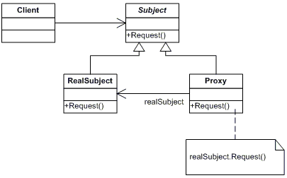

# Proxy Pattern

- Proxy means ‘in place of’, representing’ or ‘in place of’ or ‘on behalf of’ are literal meanings of proxy and that directly explains Proxy Design Pattern.
- Proxies are also called surrogates, handles, and wrappers
- A real world example can be a cheque or credit card is a proxy for what is in our bank account. It can be used in place of cash, and provides a means of accessing that cash when required. And that’s exactly what the Proxy pattern does – “Controls and manage access to the object they are protecting“.

## Example Seanario

- A very simple real life scenario is our school/office internet, which restricts few site access. The proxy first checks the host you are connecting to, if it is not part of restricted site list, then it connects to the real internet. This example is based on Protection proxies.

``` java

    public interface Internet {
        public void connectTo(String serverHost) throws Exception;
    }


    public class RealInternet implements Internet
        {
            @Override
            public void connectTo(String serverhost)
            {
                System.out.println("Connecting to "+ serverhost);
            }
        }

    public class ProxyInternet implements Internet
    {
        private Internet internet = new RealInternet();
        private static List<String> bannedSites;
        
        static
        {
            bannedSites = new ArrayList<String>();
            bannedSites.add("abc.com");
            bannedSites.add("def.com");
            bannedSites.add("ijk.com");
            bannedSites.add("lnm.com");
        }
        
        @Override
        public void connectTo(String serverhost) throws Exception
        {
            if(bannedSites.contains(serverhost.toLowerCase()))
            {
                throw new Exception("Access Denied");
            }
            
            internet.connectTo(serverhost);
        }

    }

    public class Client
    {
        public static void main (String[] args)
        {
            Internet internet = new ProxyInternet();
            try
            {
                internet.connectTo("geeksforgeeks.org");
                internet.connectTo("abc.com");
            }
            catch (Exception e)
            {
                System.out.println(e.getMessage());
            }
        }
    }


```

### Output

```
Connecting to geeksforgeeks.org
Access Denied
```

## UML

